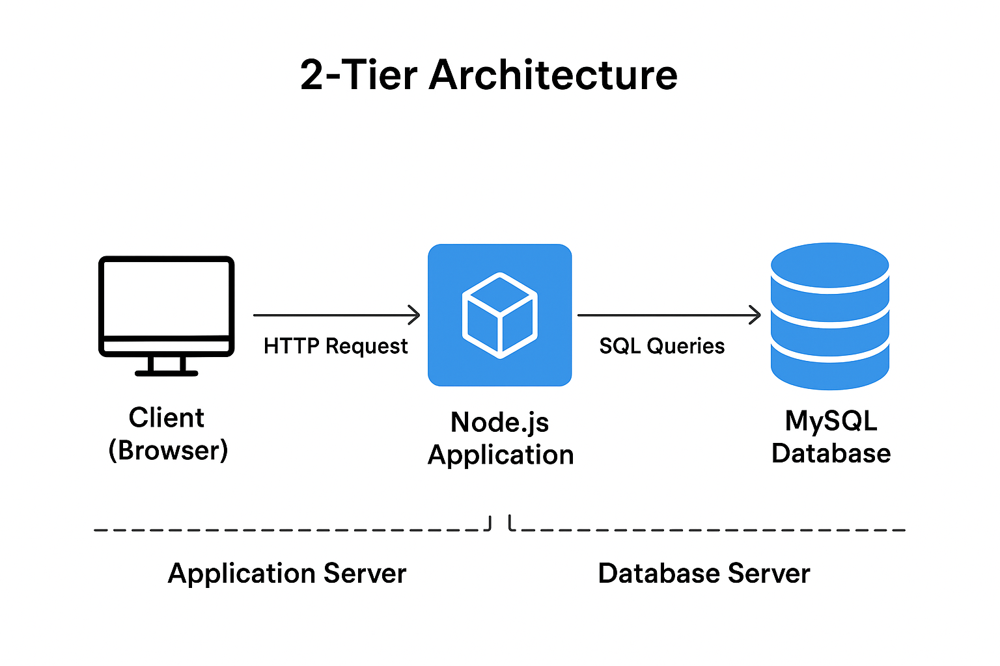

# 📘 2-Tier Application Deployment with Bash Scripts

This project demonstrates **automated setup and deployment** of a simple Node.js + MySQL application (The Epic Book Store) using Bash scripts on Ubuntu.  

It contains three scripts:
- `script.sh` → Main automation script
- `sqlsetup.sh` → MySQL installation and configuration script
- `remove_sql.sh` → Clean uninstallation of MySQL

---

## 🚀 Project Workflow

### 1. **Main Setup Script (`script.sh`)**
This is the entry point of the automation. It performs the following:

- **Checks root user**  
  Ensures the script is being run as root (`UID -ne 0` check).

- **Installs required packages**  
  Installs `git`, `nodejs`, `npm` using `installPackage` function.

- **Sets up MySQL**  
  Calls `sqlsetup.sh` which installs and configures MySQL.

- **Clones the application repository**  
  ```bash
  git clone https://github.com/pravinmishraaws/theepicbook.git


### Installs dependencies
Runs npm install inside the project folder.

### Seeds the database
Imports schema and seed data into MySQL:
```javascript
mysql -u root -p"${MYSQL_ROOT_PASSWORD}" bookstore < db/BuyTheBook_Schema.sql
mysql -u root -p"${MYSQL_ROOT_PASSWORD}" bookstore < db/author_seed.sql
mysql -u root -p"${MYSQL_ROOT_PASSWORD}" bookstore < db/books_seed.sql
```
### Updates application configuration
Automatically modifies config/config.json with correct DB credentials using sed.

### Runs the Node.js server
Starts the server in the background:
```javascript
nohup node server.js > server.log 2>&1 &
```
---
### 2. MySQL Setup Script (sqlsetup.sh)

This script ensures MySQL is installed and configured properly.

Installs MySQL server

Enables and starts MySQL service

Sets root password and switches authentication plugin to mysql_native_password

Creates a bookstore database

---
### 3. MySQL Removal Script (remove_sql.sh)

This script is used to completely uninstall MySQL from the system.

Stops MySQL service

Removes MySQL packages (mysql-server, mysql-client, etc.)

Deletes MySQL directories (/etc/mysql, /var/lib/mysql, /var/log/mysql)

Cleans up unused packages

---
### 🛠️ How to Run
Prerequisites

Ubuntu-based system

Root access (sudo or root user)

Steps

1. Clone this repository:
```javascript
git clone <your-repo-url>
cd <repo-folder>
```
2. Run the main setup script:
```javascript
sudo bash script.sh
```
3. Once the script finishes:
- MySQL will be installed and configured
- Application will be deployed
- Server will be running in the background on default Node.js port (3000)

4. Check if the app is running:
```javascript
ps aux | grep node
tail -f theepicbook/server.log
```
5. To stop the app:
```javascript
pkill node
```
6. To remove MySQL completely:
```javascript
sudo bash remove_sql.sh
```

---
### 📂 Project Structure
```javascript
.
├── remove_sql.sh   # Removes MySQL completely
├── script.sh       # Main automation script
└── sqlsetup.sh     # MySQL setup script
```

---
### ✨ Features

Full automation of 2-tier app (Node.js + MySQL)

Database schema and seed data auto-imported

Config file auto-updated with DB credentials

MySQL clean uninstall script included

Background server execution with logging


### ⚠️ Note

Default MySQL root password: NewStrongPassword123! (change it in scripts before running in production).

Application cloned from lalit192977/theepicbook

---

# 2-Tier Application Setup with Script

This project deploys a **Node.js application** with a **MySQL database** using automated shell scripts.

## Architecture Diagram


